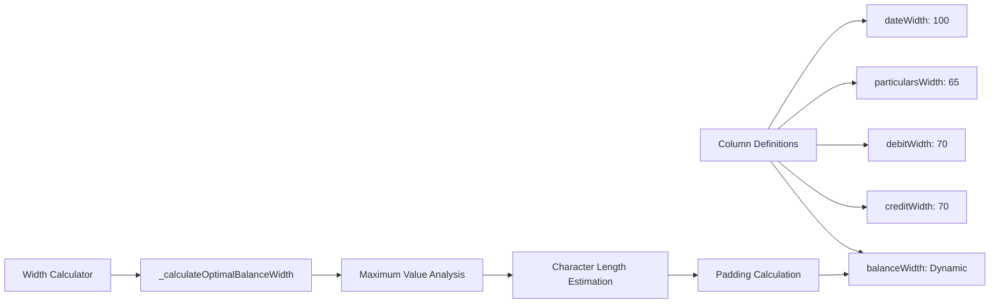
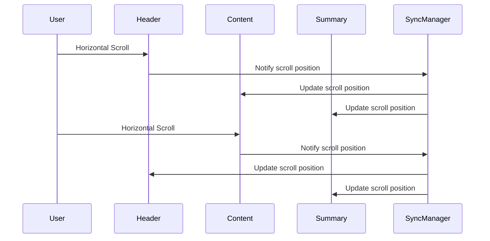
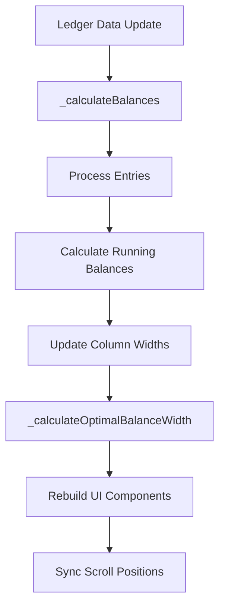

# Ledger Page Synchronization Fix Design

## Overview

The ledger page in the accounting app currently has synchronization issues between the table header, content rows, and bottom totals section. When users scroll horizontally to view debit/credit columns, the alignment is not properly maintained across all sections. This design document outlines the technical solution to achieve perfect synchronization between the table header, ledger entries, and bottom summary totals.

## Technology Stack & Dependencies

- **Framework**: Flutter (Dart)
- **UI Widgets**: Table, SingleChildScrollView, Row, Column, Container
- **State Management**: StatefulWidget with local state
- **Scroll Controllers**: Multiple synchronized ScrollController instances
- **Layout**: Fixed-width columns with dynamic sizing

## Current Architecture Issues

### Identified Problems

1. **Header-Content Misalignment**: The table header and content rows use different layout mechanisms (Table widget vs Row widgets) causing width inconsistencies
2. **Bottom Totals Synchronization**: The bottom summary section has partial synchronization but doesn't maintain proper column alignment when scrolling
3. **Dynamic Width Calculation**: The `balanceWidth` adjustment affects synchronization timing
4. **Scroll Controller Coordination**: Complex flag-based synchronization prone to edge cases

### Current Implementation Analysis

```mermaid
graph TD
    A[Top Header ScrollView] --> B[_topHorizontalController]
    C[Content ScrollView] --> B
    D[Bottom Summary ScrollView] --> E[_bottomHorizontalController]
    B --> F[Sync Logic with Flags]
    E --> F
    F --> G[jumpTo() Method]
    
    H[Table Header] --> I[Fixed Table Widget]
    J[Content Rows] --> K[Table Widget]
    L[Bottom Summary] --> M[Row with SizedBox]
```

## Component Architecture

### Synchronized Scroll System

The solution implements a three-tier synchronized scrolling architecture:

#### 1. Header Section
- **Widget Type**: Table widget with fixed column widths
- **Scroll Controller**: `_headerHorizontalController`
- **Content**: Column headers (Date, Particulars, Debit, Credit, Running Balance)

#### 2. Content Section  
- **Widget Type**: ListView.builder with Table widgets for each row
- **Scroll Controller**: `_contentHorizontalController`
- **Content**: Transaction entries with consistent column widths

#### 3. Bottom Summary Section
- **Widget Type**: Custom Row layout with aligned containers
- **Scroll Controller**: `_summaryHorizontalController`
- **Content**: Opening Balance, Period Total, Closing Balance

### Column Width Management



## Data Flow Between Layers

### Scroll Synchronization Flow



### Data Update Flow



## Testing Strategy

### Unit Testing Approach

#### 1. Scroll Synchronization Tests
```dart
// Test scroll controller synchronization
testWidgets('Scroll controllers maintain synchronization', (tester) async {
  // Verify header scroll updates content and summary
  // Verify content scroll updates header and summary  
  // Verify summary scroll updates header and content
});
```

#### 2. Column Width Consistency Tests
```dart
// Test column width calculations
test('Column widths remain consistent across sections', () {
  // Verify dateWidth, particularsWidth, debitWidth, creditWidth consistency
  // Test dynamic balanceWidth calculation
  // Validate total table width computation
});
```

#### 3. Layout Alignment Tests
```dart
// Test visual alignment
testWidgets('Column alignment is maintained during scroll', (tester) async {
  // Verify header columns align with content columns
  // Verify summary amounts align with respective columns
  // Test alignment at different scroll positions
});
```

### Widget Testing

#### 1. Scroll Behavior Testing
- Test horizontal scrolling in all three sections
- Verify scroll position synchronization
- Test edge cases (beginning/end of scroll)
- Validate smooth scrolling performance

#### 2. Dynamic Width Testing  
- Test balance width calculation with various number formats
- Verify responsive layout on different screen sizes
- Test column width consistency during data updates

#### 3. Integration Testing
- Test complete user workflows with scrolling
- Verify data accuracy during scroll operations
- Test performance with large datasets

### Manual Testing Scenarios

#### 1. Basic Synchronization
- **Scenario**: User scrolls header to view debit/credit columns
- **Expected**: Content and summary sections scroll simultaneously
- **Verification**: All debit amounts align vertically, all credit amounts align vertically

#### 2. Content-Initiated Scrolling
- **Scenario**: User scrolls within the content area
- **Expected**: Header and summary sections follow the scroll
- **Verification**: Column headers remain aligned with content columns

#### 3. Summary-Initiated Scrolling  
- **Scenario**: User scrolls within the bottom summary area
- **Expected**: Header and content sections synchronize
- **Verification**: Summary amounts align with their respective columns

#### 4. Dynamic Width Adjustment
- **Scenario**: Large balance values trigger width recalculation
- **Expected**: All sections adjust column widths consistently
- **Verification**: Synchronization is maintained after width changes

#### 5. Rapid Scrolling
- **Scenario**: User performs quick, repeated scroll gestures
- **Expected**: Synchronization remains stable without lag
- **Verification**: No visual artifacts or misalignment occurs

#### 6. Edge Case Testing
- **Scenario**: Scroll to extreme positions (far left/right)
- **Expected**: All sections maintain alignment at boundaries
- **Verification**: No content is cut off or misaligned

## Implementation Approach

### Phase 1: Scroll Controller Architecture Redesign

#### Enhanced Synchronization Manager

```dart
class ScrollSynchronizationManager {
  final ScrollController headerController = ScrollController();
  final ScrollController contentController = ScrollController();
  final ScrollController summaryController = ScrollController();
  
  bool _isUpdating = false;
  
  void initializeSync() {
    headerController.addListener(() => _syncScroll('header'));
    contentController.addListener(() => _syncScroll('content'));
    summaryController.addListener(() => _syncScroll('summary'));
  }
  
  void _syncScroll(String source) {
    if (_isUpdating) return;
    _isUpdating = true;
    
    final position = _getSourcePosition(source);
    _updateOtherControllers(source, position);
    
    _isUpdating = false;
  }
}
```

#### Column Width Management System

```dart
class ColumnWidthManager {
  static const double dateWidth = 100;
  static const double particularsWidth = 65;
  static const double debitWidth = 70;
  static const double creditWidth = 70;
  
  double _balanceWidth = 70;
  
  double get balanceWidth => _balanceWidth;
  double get totalTableWidth => dateWidth + particularsWidth + debitWidth + creditWidth + _balanceWidth;
  
  void updateBalanceWidth(List<Map<String, dynamic>> entries) {
    final maxBalance = _findMaxBalanceValue(entries);
    final requiredWidth = _calculateRequiredWidth(maxBalance);
    _balanceWidth = math.max(70, requiredWidth);
  }
}
```

### Phase 2: Unified Layout System

#### Consistent Table Structure

Replace mixed layout approaches with a unified Table-based system:

```dart
Widget _buildUnifiedTableSection({
  required List<Widget> rows,
  required ScrollController controller,
  required bool isScrollable,
}) {
  final columnWidths = {
    0: FixedColumnWidth(dateWidth),
    1: FixedColumnWidth(particularsWidth),
    2: FixedColumnWidth(debitWidth),
    3: FixedColumnWidth(creditWidth),
    4: FixedColumnWidth(balanceWidth),
  };
  
  Widget tableWidget = Table(
    border: TableBorder.all(color: const Color(0xFF2C5545), width: 1),
    columnWidths: columnWidths,
    children: rows.map((row) => row as TableRow).toList(),
  );
  
  if (isScrollable) {
    return SingleChildScrollView(
      controller: controller,
      scrollDirection: Axis.horizontal,
      child: SizedBox(
        width: totalTableWidth,
        child: tableWidget,
      ),
    );
  }
  
  return tableWidget;
}
```

#### Synchronized Bottom Summary

```dart
Widget _buildSynchronizedSummary() {
  return _buildUnifiedTableSection(
    controller: _summaryController,
    isScrollable: true,
    rows: [
      _buildSummaryRow('Opening Balance :', obDebit, obCredit, ''),
      _buildSummaryRow('Period Total :', totalDebit, totalCredit, ''),
      _buildSummaryRow('Closing Balance :', '', '', closingBalanceText),
    ],
  );
}

TableRow _buildSummaryRow(String label, dynamic debit, dynamic credit, String balance) {
  return TableRow(
    children: [
      _buildSummaryCell(''),  // Date column empty
      _buildSummaryCell(label, isBold: true),  // Particulars with label
      _buildSummaryCell(debit.toString(), isAmount: true),  // Debit amount
      _buildSummaryCell(credit.toString(), isAmount: true),  // Credit amount  
      _buildSummaryCell(balance, isAmount: true),  // Balance
    ],
  );
}
```

### Phase 3: Performance Optimization

#### Efficient Rebuild Strategy

```dart
class LedgerViewOptimized extends StatefulWidget {
  @override
  State<LedgerViewOptimized> createState() => _LedgerViewOptimizedState();
}

class _LedgerViewOptimizedState extends State<LedgerViewOptimized> {
  late final ScrollSynchronizationManager _scrollManager;
  late final ColumnWidthManager _widthManager;
  
  @override
  void initState() {
    super.initState();
    _scrollManager = ScrollSynchronizationManager();
    _widthManager = ColumnWidthManager();
    _scrollManager.initializeSync();
  }
  
  @override
  Widget build(BuildContext context) {
    return Column(
      children: [
        _buildHeader(),
        Expanded(child: _buildContent()),
        _buildSummary(),
      ],
    );
  }
}
```

#### Memory Management

```dart
@override
void dispose() {
  _scrollManager.dispose();
  super.dispose();
}
```

### Phase 4: Error Handling & Edge Cases

#### Robust Synchronization

```dart
void _safeSyncScroll(String source, double position) {
  try {
    if (_isUpdating || !mounted) return;
    
    _isUpdating = true;
    
    // Validate position bounds
    final clampedPosition = position.clamp(0.0, _getMaxScrollPosition());
    
    // Update other controllers
    _updateControllersExcept(source, clampedPosition);
    
  } catch (e) {
    debugPrint('Scroll sync error: $e');
  } finally {
    _isUpdating = false;
  }
}
```

#### Graceful Degradation

```dart
Widget _buildFallbackLayout() {
  // Fallback to basic layout if synchronization fails
  return SingleChildScrollView(
    child: Column(
      children: [
        _buildSimpleTable(),
        _buildSimpleSummary(),
      ],
    ),
  );
}
```

## Technical Specifications

### Column Width Constants
- **Date Column**: 100px fixed width
- **Particulars Column**: 65px fixed width  
- **Debit Column**: 70px fixed width
- **Credit Column**: 70px fixed width
- **Balance Column**: Dynamic (minimum 70px, maximum 400px)

### Scroll Synchronization Requirements
- **Response Time**: < 16ms for 60fps smooth scrolling
- **Accuracy**: Pixel-perfect alignment across all sections
- **Memory Usage**: Minimal overhead from scroll listeners
- **Platform Compatibility**: Consistent behavior on all Flutter platforms

### Layout Constraints
- **Minimum Table Width**: Sum of all fixed column widths (375px)
- **Maximum Table Width**: 1.4x screen width for extended scrolling
- **Responsive Behavior**: Adapt to screen size changes
- **Orientation Support**: Maintain functionality in portrait/landscape

### Performance Targets
- **Initial Load**: < 500ms for 100 ledger entries
- **Scroll Performance**: 60fps sustained scrolling
- **Memory Footprint**: < 10MB additional overhead for synchronization
- **CPU Usage**: < 5% during active scrolling